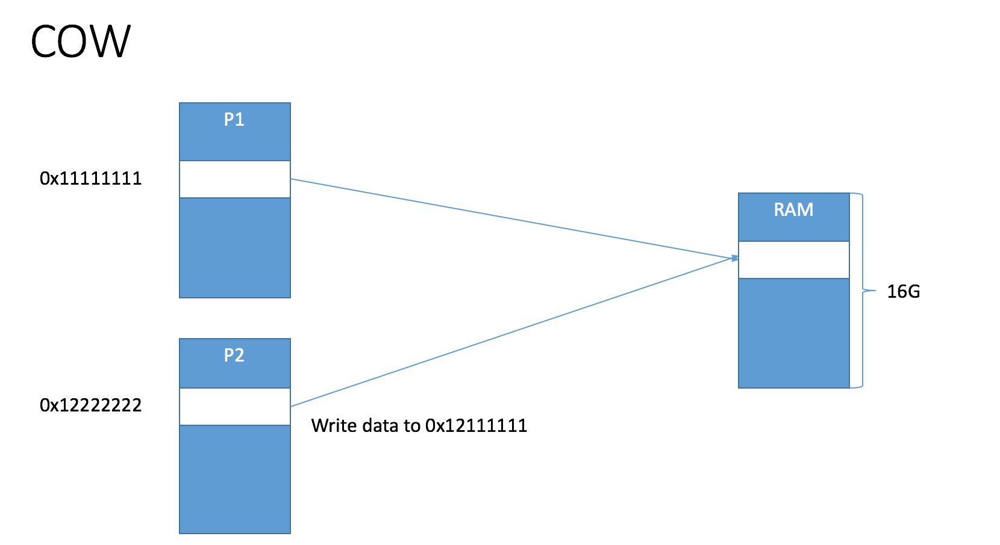
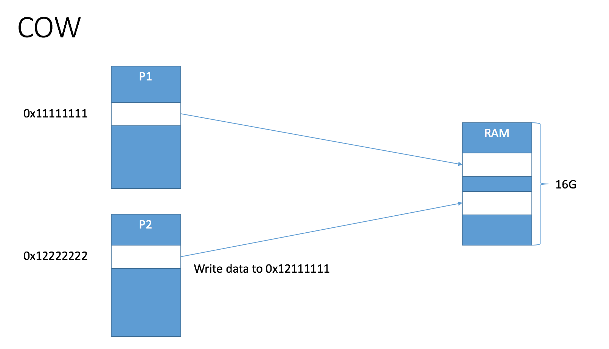

对于VM(Virtual Memory)和RAM的概念一直就没搞清楚，更别说sharedMemory和copy-on-write(COW)了。

## RAM
RAM就是我们买电脑时常说的内存，是一个看得见，摸得着，真真实实存在的一个设备，就跟磁盘一样，也是存放数据的，不过磁盘存放的数据具有持久性，而内存只是保存了一个程序运行时所需要的数据。

## 虚拟内存(VM)
​	虚拟内存是搞计算机那帮人为了解决各种问题提出的一个概念，通过一种映射关系，让人感觉每个进程都有一个独立的RAM一样。每一个进程的VM“大小”跟机器的位数有关，32位机器的VM大小是4G(2的32次方bits)，而64位机器的VM大小是16G(2的64次方bits)。以下都用64位机器举例子。

​	这里就会有一个让人迷惑的问题，一般来说，我们的电脑内存都是4G，8G等等，而这里一个进程的VM就16G，根本不够一个进程使用。况且如果我们开了10个进程，那岂不是要160G的内存才够？

​	虚拟内存之所有叫虚拟内存，就是因为它并不是真是存在的。一个进程的内存空间是16G，这句话并没有错，但这个内存空间只是假想出来的，而实际上一个进程可能只用了RAM几十兆的空间。

​	这里举一个我自己编造的例子，假如世界上有一个神仙，负责为地球上每一个人类分配寿命，他手里一共有2^64年可以分配，而且假设人类的理论最大年龄可以到2^64岁，但是一个人的生命中会遇到各种各样的意外，甚至很难超过128(2^7)岁，因此对于2^64来说，简直微乎其微。(即使真有谁活到了2^32次方或者更高，神仙会立马注意到自己可分配的年变少了，于是找到当前活得最长的人，把他kill掉，以释放更多的年限去分配给更多的人类)

​	这里的神仙就是MMU(内存管理单元)，他手上可分配的年限就是RAM，而一个人类就是一个进程，一个人类的理论寿命就是虚拟内存。活得时间太长被神仙干掉的场景就叫做memory pressure。

## 共享内存(shared Memory)

​	前面提到，程序真正使用的数据是存放在RAM上的，VM只是一个映射关系，一般情况下，这种映射关系是一对一的映射。而共享内存便是多对一的情况，即两个进程中存在对同一个RAM地址的映射，如图：

​	上图中，进程1和进程2都有一个内存地址指向RAM的同一个地方，这就是共享内存。因此进程1中对0x11111111这个地方的修改会直接影响到进程2中0x12222222的地方。

## Copy-on-write

​	copy-on-write，翻译过来是写时复制，即，写的时候才分配内存。直接看图:

首先，进程1和进程2仍然是共享一块RAM，假设进程2对这块内存准备进行修改，此时会再在RAM上单独开辟一块新的内存，然后将进程2的0x12222222地址映射到RAM新开辟的那个地方。

